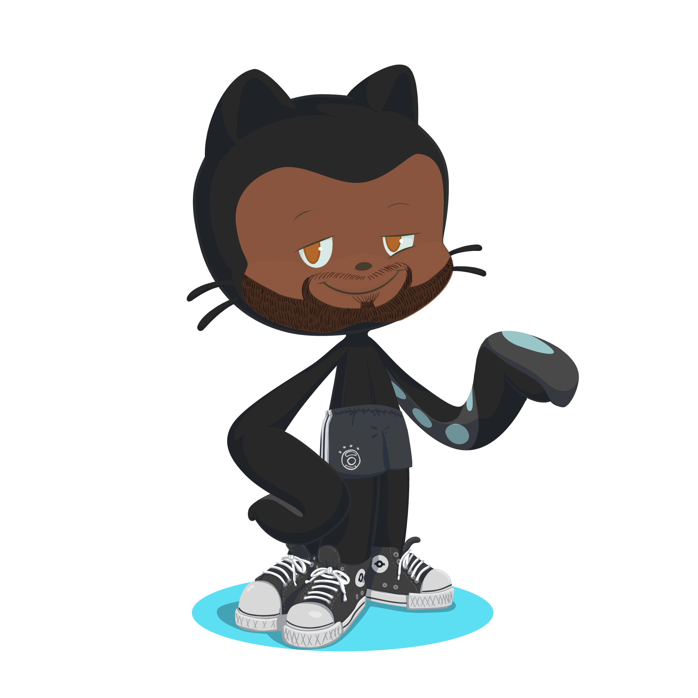

  <h1 align="center">Hi there, I'm Kenneth Kwakye-Gyamfi</h1>

  
I like to code, learn and experiment with new things. I am an enthusiastic and open-minded person who loves to take up new challenges and learn new skills. I love meeting new people, exchanging ideas and spreading knowledge and positivity.

  

  

        
    
  

### About me

I'm a mobile and web full stack developer 👨🏾‍💻 currently based in Accra, Ghana.

- 🌱 Currently studied to move from a senior to an expert role in mobile application development
- 🏘 Open-source contributor (when I have the time to)
- 🏀 Anthony Davis fan (where he goes, I go)

